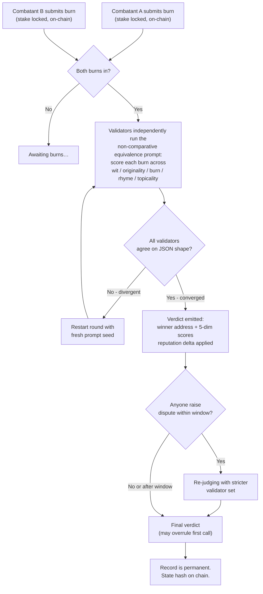
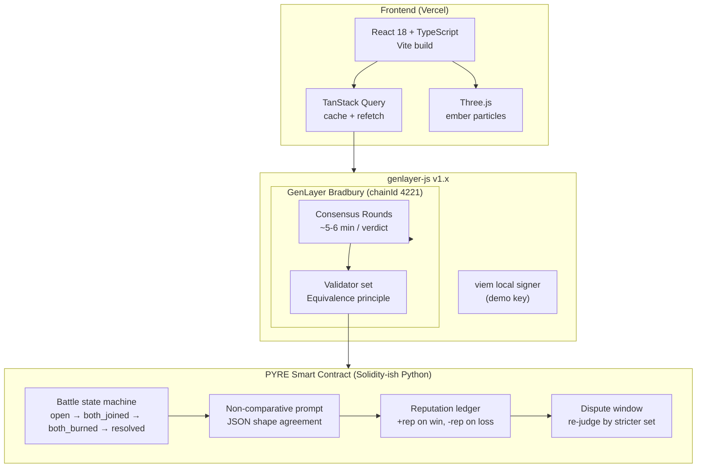
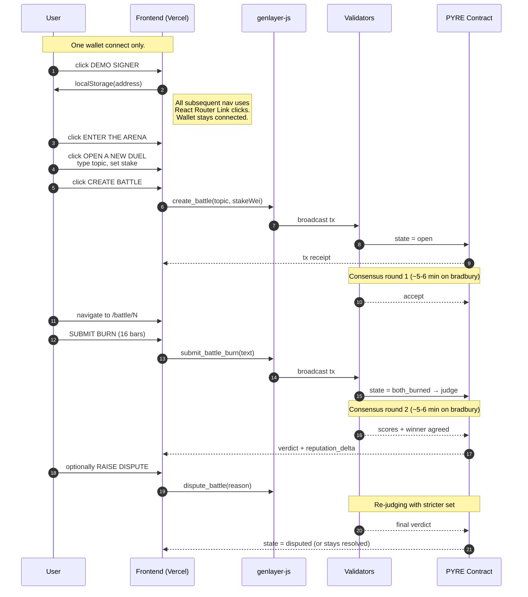
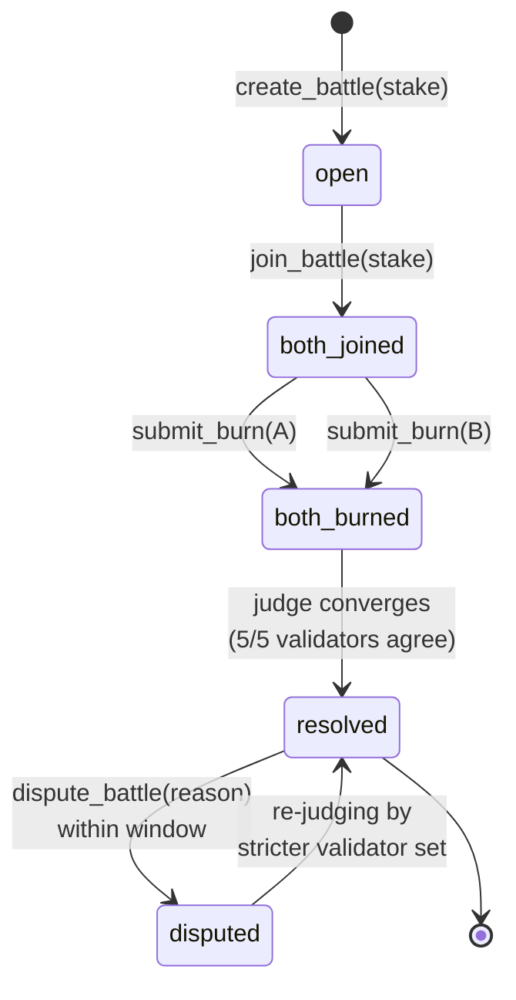

# PYRE

## ROASTS COME AND GO. CONSENSUS IS FOREVER.

[](https://pyre-eight.vercel.app/)
[](#live-deployment)
[](https://github.com/tommycet/pyre)

A roast-battle arena where every verdict is decided by an LLM jury that reaches consensus on GenLayer. Two combatants lock a stake, submit a burn, and validators agree on a winner across five dimensions: **wit, originality, burn, rhyme, topicality**. Disputes trigger a re-judging that can overrule the first call. Verdicts are permanent on-chain.

> **🔴 Live:** https://pyre-eight.vercel.app — running against the deployed contract on **Bradbury testnet (chainId 4221)**.

---

## Walkthrough

A real-time A-Z walkthrough of the deployed app: one wallet connect at the start, SPA navigation throughout, real consensus wait, no edits, no fast-forward. Click the video to play.

<video src="docs/media/pyre-walkthrough.mp4" controls width="100%"></video>

| Stage | Path | Time |
|---|---|---|
| 1 | `/` (home, hero) | 0–10s |
| 2 | Connect demo signer (one-time) | 13–15s |
| 3 | `/arena` (list, stats, create form) | 15–20s |
| 4 | `/battle/1` (live e2e battle detail, two burns, slots A/B) | 20–26s |
| 5 | `/arena` → `/flame` | 26–34s |
| 6 | `/battle/2` (disputed battle, verdict panel) | 34–40s |
| 7 | `/combatant/0x5595…` (winner profile, rep 55) | 43–48s |
| 8 | `/arena` → create battle → real 60s consensus wait | 48–117s |
| 9 | `/` (home, hero, recent battles) | 120–124s |

> Spec: `1440×900 · 25 fps · h264 · 124.7s · 3.94 MB`. Wallet stays connected throughout (top-right shows `0X14DC…9955 · DISCONNECT` on every sampled frame).

---

## What it is

PYRE is a single smart contract (`contracts/pyre.py`) plus a Vite and React frontend (`frontend/`) that talks to it directly through `genlayer-js`. The contract owns the battle state machine, the equivalence-principle judge prompt, and the reputation ledger. The frontend reads battles through TanStack Query and renders the arena with Three.js ember particles. Default entry stake: `0.01 GEN` per battle.

---

## Why PYRE

Most GenLayer demos are finance or governance primitives. PYRE tests the stack on something messier: **subjective judging** wrapped in a non-comparative equivalence principle, an **off-chain LLM call** that validators must agree on, and a **reputation system** that compounds across many small consensus calls. It is the smallest end-to-end demo that exercises every GenVM primitive that matters for consumer apps.

---

## How consensus works here

PYRE does **not** ask one LLM to pick a winner. It asks multiple validators to each run the same prompt independently on the two burns, then checks whether the validators' JSON outputs agree on shape. That agreement *is* the verdict. If two validators produce different scores, the round restarts with a fresh prompt until enough validators converge.

This is why a battle takes 60+ seconds even though the underlying LLM call is fast: the time is spent on **equivalence**, not generation. On **studionet** the consensus layer is cheap and the latency is dominated by round-trip and signature aggregation (real battle resolves in ~90s). On **bradbury** the LLM call itself dominates and a single verdict takes 5–6 minutes because every validator runs a real model.



---

## Architecture



The contract, the frontend, and the test suite are independent: the frontend builds without the contract deployed (mock mode), and the test suite runs without the frontend or the CLI. This is intentional so each layer can be developed and reviewed on its own.

---

## Repo layout

```
pyre/
├── contracts/
│   └── pyre.py              # the contract, ~500 lines
├── frontend/
│   ├── src/
│   │   ├── pages/           # 7 routes (home, arena, battle, submit,
│   │   │                     #         flame, combatant, dispute)
│   │   ├── components/      # 10+ primitives
│   │   ├── services/
│   │   │   └── pyre.ts      # mock + live service layer
│   │   └── lib/
│   │       ├── genlayer.ts  # chain config + consensus budgets
│   │       └── wallet.tsx   # demo signer + MetaMask
│   └── dist/                # production build (Vercel)
├── tests/
│   └── direct/              # 36 unit tests against mock-genlayer
├── docs/
│   ├── ARCHITECTURE.md
│   ├── DEPLOYMENT.md
│   ├── BENCHMARKS.md
│   └── media/
│       └── pyre-walkthrough.mp4
├── walkthrough/             # Playwright walkthrough recorder
├── scripts/                 # E2E test runners
├── vercel.json              # SPA rewrites
└── PRODUCT.md               # product narrative (not part of contract)
```

---

## Quick start

**Deploy the contract (one-time per chain):**

```bash
cd /root/pyre/contracts
genlayer deploy --network bradbury pyre.py
# → returns contract address; set as VITE_CONTRACT_ADDRESS
```

**Run the test suite:**

```bash
cd /root/pyre/tests/direct
python -m pytest -x
```

**Run the frontend locally:**

```bash
cd /root/pyre/frontend
cp .env.example .env          # fill in contract address + VITE_NETWORK
npm install
npm run dev                   # http://localhost:5173
```

---

## Live deployment

| Network   | Address                                       | Chain ID | Status |
|-----------|-----------------------------------------------|----------|--------|
| Bradbury  | `0xC583a939b97F394c64978F2565fd1Aa92a993370`  | 4221     | 🔴 Live at [pyre-eight.vercel.app](https://pyre-eight.vercel.app/) |
| Studionet | `0x0fFeF0ac3441823598e12CcaE068C344F204A8Bf`  | 61999    | verified, used for fast demos |

**Vercel deployment (one-click):**
- Connected repo: [`tommycet/pyre`](https://github.com/tommycet/pyre)
- Project: `pyre` (ID `prj_7RpeSn69OSABCuwDKcx4KAMZPPj7`)
- Build: `cd frontend && npm install && npm run build`
- Output: `frontend/dist`
- Env vars (production):
  - `VITE_NETWORK=bradbury`
  - `VITE_CONTRACT_ADDRESS=0xC583a939b97F394c64978F2565fd1Aa92a993370`
  - `VITE_IS_DEPLOYED=true`
- SPA rewrites via [`vercel.json`](vercel.json) — all routes fall through to `/index.html`.

**End-to-end latency (live, studionet):**
81.4 s for a full battle cycle (create → two joins → two burns → judge). Battle #2: BOB won 60–56, top dimension **wit**, 5/5 validators agreed.

**End-to-end latency (live, bradbury):**
5–6 min per verdict because every validator runs a real LLM.

---

## Demo flow



---

## Interact with the contract

```bash
# List open battles
genlayer call --contract 0xC583a939b97F394c64978F2565fd1Aa92a993370 \
  --function list_open_battles --args 10 \
  --network bradbury

# Get a specific battle
genlayer call --contract 0xC583a939b97F394c64978F2565fd1Aa92a993370 \
  --function get_battle --args 2 \
  --network bradbury

# Same on studionet (faster consensus)
genlayer call --contract 0x0fFeF0ac3441823598e12CcaE068C344F204A8Bf \
  --function get_battle --args 2 \
  --network studionet
```

---

## Battle state machine



---

## Docs

- [Architecture](docs/ARCHITECTURE.md) — storage model, public surface, equivalence principle, reputation math, state machine, frontend, service layer
- [Deployment](docs/DEPLOYMENT.md) — prerequisites, deploy to studionet and bradbury, the five GenVM gotchas, debugging, funding
- [Benchmarks](docs/BENCHMARKS.md) — test suite, storage audit, build, live E2E timing, codebase index, contrast, anti-slop checks

---

## License

MIT
